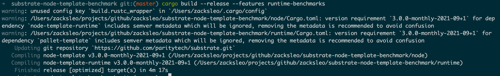

# Substrate Node Template Benchmark


## 编译

```bash
cargo build --release --features runtime-benchmarks
```

输出如下



## Benchmark

```bash
➜  substrate-node-template-benchmark git:(master) ✗ ./target/release/node-template benchmark --chain dev --execution=wasm --wasm-execution=compiled --pallet pallet_template --extrinsic do_something --steps 50 --repeat 20 --template=./.maintain/frame-weight-template.hbs --output=./pallets/template/src/weights.rs
```

输出如下:

```text
Pallet: "pallet_template", Extrinsic: "do_something", Lowest values: [], Highest values: [], Steps: 50, Repeat: 20
Raw Storage Info
========
Storage: TemplateModule Something (r:0 w:1)

Median Slopes Analysis
========
-- Extrinsic Time --

Model:
Time ~=       39
    + s        0
              µs

Reads = 0 + (0 * s)
Writes = 1 + (0 * s)

Min Squares Analysis
========
-- Extrinsic Time --

Data points distribution:
    s   mean µs  sigma µs       %
    0      40.4       0.8    1.9%
   20      40.2     0.871    2.1%
   40      41.2     0.748    1.8%
   60      38.6     0.489    1.2%
   80      39.3     1.345    3.4%
  100      38.5       0.5    1.2%
  120      39.3      0.64    1.6%
  140      38.5       0.5    1.2%
  160      38.6     0.663    1.7%
  180      38.6     0.489    1.2%
  200      38.8       0.4    1.0%
  220      38.9     0.538    1.3%
  240      38.6     0.663    1.7%
  260        39         0    0.0%
  280      38.4     0.489    1.2%
  300      39.4     0.489    1.2%
  320      39.8       0.6    1.5%
  340      40.9       1.3    3.1%
  360        39     0.447    1.1%
  380      39.4     0.663    1.6%
  400      39.6     1.496    3.7%
  420      41.3     0.458    1.1%
  440      41.4     0.489    1.1%
  460      41.9       0.3    0.7%
  480      38.6     0.489    1.2%
  500        39         0    0.0%
  520      41.2       0.4    0.9%
  540      39.8       0.4    1.0%
  560      39.7     0.458    1.1%
  580      39.8     0.871    2.1%
  600      39.3     0.781    1.9%
  620      38.5       0.5    1.2%
  640      40.2     1.166    2.9%
  660      38.7      0.64    1.6%
  680      38.9       0.7    1.7%
  700      38.4     0.489    1.2%
  720      39.8     1.536    3.8%
  740      39.8     1.248    3.1%
  760      38.6     0.489    1.2%
  780      41.4     0.489    1.1%
  800      38.1       0.3    0.7%
  820      39.1      0.83    2.1%
  840      38.9       0.7    1.7%
  860      38.5       0.5    1.2%
  880        39         0    0.0%
  900      38.9       0.3    0.7%
  920      39.2     0.979    2.4%
  940      38.9       0.7    1.7%
  960      41.8       0.4    0.9%
  980      41.8       0.4    0.9%
 1000      41.2       0.4    0.9%

Quality and confidence:
param     error
s             0

Model:
Time ~=    39.32
    + s        0
              µs

Reads = 0 + (0 * s)
Writes = 1 + (0 * s)
```

输出 weight.rs

https://github.com/zacksleo/substrate-node-template-benchmark/blob/master/pallets/template/src/weights.rs

```rust

/// ---snip----

#![cfg_attr(rustfmt, rustfmt_skip)]
#![allow(unused_parens)]
#![allow(unused_imports)]

use frame_support::{traits::Get, weights::{Weight, constants::RocksDbWeight}};
use sp_std::marker::PhantomData;

/// Weight functions needed for pallet_template.
pub trait WeightInfo {
	fn do_something(s: u32, ) -> Weight;
}

/// Weights for pallet_template using the Substrate node and recommended hardware.
pub struct SubstrateWeight<T>(PhantomData<T>);
impl<T: frame_system::Config> WeightInfo for SubstrateWeight<T> {
	// Storage: TemplateModule Something (r:0 w:1)
	fn do_something(_s: u32, ) -> Weight {
		(39_329_000 as Weight)
			.saturating_add(T::DbWeight::get().writes(1 as Weight))
	}
}

// For backwards compatibility and tests
impl WeightInfo for () {
	// Storage: TemplateModule Something (r:0 w:1)
	fn do_something(_s: u32, ) -> Weight {
		(39_329_000 as Weight)
			.saturating_add(RocksDbWeight::get().writes(1 as Weight))
	}
}
```
